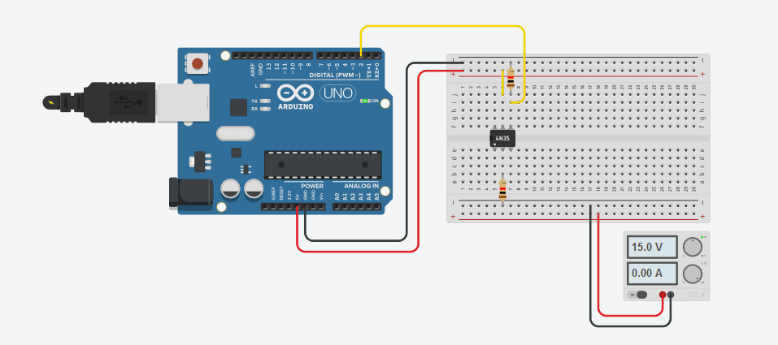

# Triangulation algorithm
Triangulation for estimating robot position using stepper motor, photoelectric retro-reflective sensor and a gyroscope for Arduino.
## Components used
* 1x [Arduino UNO](https://store.arduino.cc/arduino-uno-smd-rev3)
* 1x 42BYGHM809 Stepper Motor
* 1x [A4988 Stepper Motor Driver](https://www.pololu.com/product/1182)
* 1x Sick WL280-2 Photoelectric retro-reflective sensor
* 1x MPU6050 Gryroscope and Accelerometer sensor
* 1x 4N25/4N35 Optocoupler
* 1x 9V-30V Power source
* 2x 1k Ohm resistors
* 3x Beacons with reflective bands on them
* 1x Breadboard

## Arduino libraries
* [I2Cdev](https://www.i2cdevlib.com/)
* MPU6050 (*included in I2Cdev*)

## Laser Wiring


* Connect the photoelectric sensor to the 9V-30V power source
* The output of the photoelectric sensor goes into the 4N25/4N35 anode. The photoelectric sensor has inverted logic: Vcc when is not reflecting, GND when it's reflecting.
* Yellow wire is the laser interrupt pin (location can be changed in code)

## Stepper motor wiring


[Source for image](http://www.instructables.com/id/Drive-a-Stepper-Motor-with-an-Arduino-and-a-A4988-/)

The source for image above can be used to connect the driver to the stepper motor and to the Arduino. The only difference is some connections:
 * *Step* pin from driver goes into Arduino's pin 4 (can be modified in code)
 * *Dir* pin from driver goes into Arduino's pin 5 (can be modified in code)

 ## Gyroscope wiring
 

 [Source for image](https://maker.pro/arduino/tutorial/how-to-interface-arduino-and-the-mpu-6050-sensor)

 Again, the link above can be used to connect the MPU6050 gyroscope to the Arduino. The only difference is that the *INT* pin from MPU6050 goes into Arduino's pin 3 (can be modified in code).

## Triangulation algorithm
The triangulation method and algorithms can be found [here](http://www.telecom.ulg.ac.be/triangulation/). In this example, I used the **ToTal** algorithm. The main problem of this algorithm is that you need to know which angle corresponds to which beacon. Without appropiate correction, this works only when the robot is moving straight, without rotation. To fix this, a gyroscope is used to correct the stepper motor position such that it always starts from the same orientation, thus knowing that the first angle corresponds to the first beacon.

For this specific stepper motor, one step means 0.9 degrees. Using the photoelectric laser mounted on top of the motor, when it reflects in any of the beacons, it generates an interrupt on the pin 2. In the interrupt routine, the angle is calculated and saved.

```
angle = steps * 0.9
```

Also, the angles are counted. If there is any reflective material on scene or some beacon was missed, the triangulation will not be done.

To fix the problem mentioned above, each time a rotation is done, the next rotation is corrected by the yaw:

```
rotationSteps = 400 - ((lastCorrectionYaw - yaw) / 0.9f);
lastCorrectionYaw = yaw;
```
Here, 400 steps means a complete rotation (360 degrees). 0.9 is used to convert from degrees to steps. In the code, you will also see the handling of jumps from 360 degrees to 0 and from 0 to 360.

The code also includes an initialization routine. This is done because the gyroscope must first correct itself. The MPU does this automatically, but in time. Usually it takes from 10 seconds to 1 minute. When you're reading the values from it, you will see that at some point it will be stable. That's when it corrected itself. When the interrupt takes place, the angle will be saved as offset and the *yaw* will be considered 0.